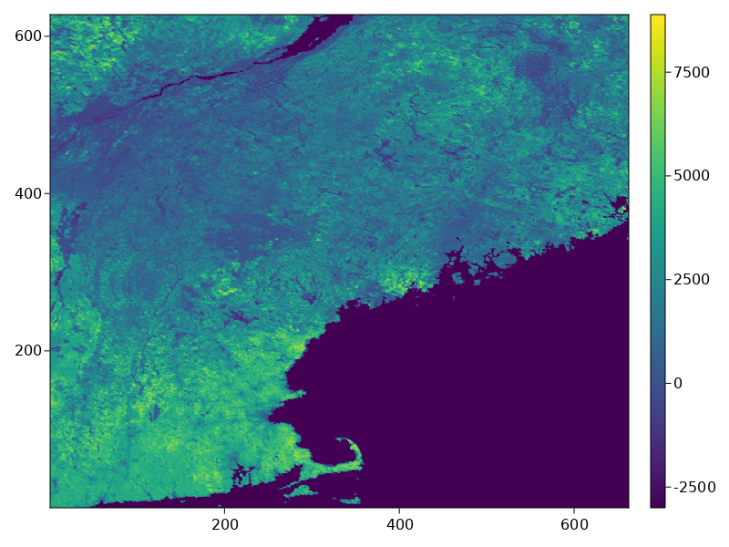

# EarthEngineREST.jl
Julia package to send REST API requests to Google Earth Engine

## Introduction

The `EarthEngineREST.jl` package aims to make connecting Earth Engine (EE) computations with Julia processing easier. This package is meant to interface with [`EarthEngine.jl`](https://kmarkert.github.io/EarthEngine.jl/dev/) and request Julia types/data from EE Types. While this package provides this functionality, the broader goal is to provide the [full capabilities of the Earth Engine REST API](https://developers.google.com/earth-engine/reference/rest)

It should be noted that restee relies on fairly new and advanced EE features that may not be suitable for all users (see [warning from the EE team](https://developers.google.com/earth-engine/reference#audience)). If you are new to Earth Engine, please get started with the [JavaScript guide](https://developers.google.com/earth-engine/getstarted).

## Installation

`EarthEngineREST.jl` is available through the Julia package registry, therefore you can install using the following code:

```
$ julia
julia> ]
pkg> add EarthEngineREST
julia> using EarthEngineREST
```

`EarthEngineREST` requires that the `EarthEngine` Julia packaged is installed as well. To do this, please see the [`EarthEngine` installation guide](https://kmarkert.github.io/EarthEngine.jl/dev/#Installation)


## Quick start

This quick start example illustrates some of the core functionality of requesting Earth Engine computations to Julia types. To get started, you will need to import the packages and authenticate the APIs:

```julia
using EarthEngine
using EarthEngineREST

session = EESession("secret_key.json")

Initialize(session)
```

Here the packages are imported and an authorized session for requesting information is created from your private key file for your service account. To get a private key file for your service account see the following the [offical Earth Engine REST API Quickstart guide](https://developers.google.com/earth-engine/reference/Quickstart#obtain-a-private-key-file-for-your-service-account). The authorized session can also be used to Initialize the `EarthEngine` API as above.

Next we will using `EathEngine` to create some computations:

```julia
states = EE.FeatureCollection("TIGER/2018/States")
neus = filter(states,inList("NAME",(
    "Maine","Vermont","New Hampshire", "Massachusetts"
)))


# Imagery: NDVI vegetation index from MODIS.
band = "NDVI"
images = select(EE.ImageCollection("MODIS/006/MOD13Q1"), band)
image = first(images)

computation = reduceRegions(
    image;
    collection=neus,
    reducer=setOutputs(mean(EE.Reducer()),(band,)),
    scale=nominalScale(projection(image))
)
```

Now that we have defined the computation, we can request that table using `computetable`.

```julia
tableresult = computetable(session, computation)

# 4×16 DataFrame
#  Row │ ALAND        AWATER       DIVISION  FUNCSTAT  GEOID   INTPTLAT     INTPTLON      LSAD    MTFCC   NAME           NDVI     REGION  STATEFP  STATENS   STUSPS  geom             ⋯
#      │ Int64        Int64        String    String    String  String       String        String  String  String         Float64  String  String   String    String  IGeometr…        ⋯
# ─────┼───────────────────────────────────────────────────────────────────────────────────────────────────────────────────────────────────────────────────────────────────────────────
#    1 │ 23189413166   1026675248  1         A         33      +43.6726907  -071.5843145  00      G4000   New Hampshire  2579.07  1       33       01779794  NH      Geometry: wkbPol ⋯
#    2 │ 23874175944   1030416650  1         A         50      +44.0685773  -072.6691839  00      G4000   Vermont        1940.65  1       50       01779802  VT      Geometry: wkbPol
#    3 │ 79887426037  11746549764  1         A         23      +45.4092843  -068.6666160  00      G4000   Maine          1911.13  1       23       01779787  ME      Geometry: wkbPol
#    4 │ 20205125364   7129925486  1         A         25      +42.1565196  -071.4895915  00      G4000   Massachusetts  4190.74  1       25       00606926  MA      Geometry: wkbPol
#                                                                                                                                                                      1 column omitted
```

We can also request image data. To do this, we need to define the geographic coordinate of to the image data we would like and then requst the data using `computepixels`:

```julia
# define a pixel grid for the Northeast US states at about 1km
pixelgrid = PixelGrid(session, neus, 0.01, "EPSG:4326")

data = computepixels(session, pixelgrid, image)
# 62x627x1 Array{Int16, 3} with AffineMap([0.01 0.0; 0.0 -0.01], [-73.50818980721034, 47.459858919112]) and CRS EPSG:4326
```

If we plot the results we should see something like the following image:



Lastly, to illustrate how to get data from non-spatial computations, here we gather some metadata information from the image and make requests.

```julia
# compute the band names and get a local array
imgbands = bandNames(image)
bandlist = computevalue(session,imgbands)
# 1-element Vector{String}:
#  "NDVI"

# compute the image date and get as local string
imgdate = format(date(image),"YYYY-MM-dd")
datestr = computevalue(session,imgdate)
# "2000-02-18"
```

Sometimes calculating statistics or reading metadata from the image/collections is needed. Using the `computevalue` above, essentially any EE.ComputedObject can be requested to a local Julia data type and continue using on our local system.

More information on the API can be found in the [API docs](https://kmarkert.github.io/EarthEngineREST.jl/dev/api/)
